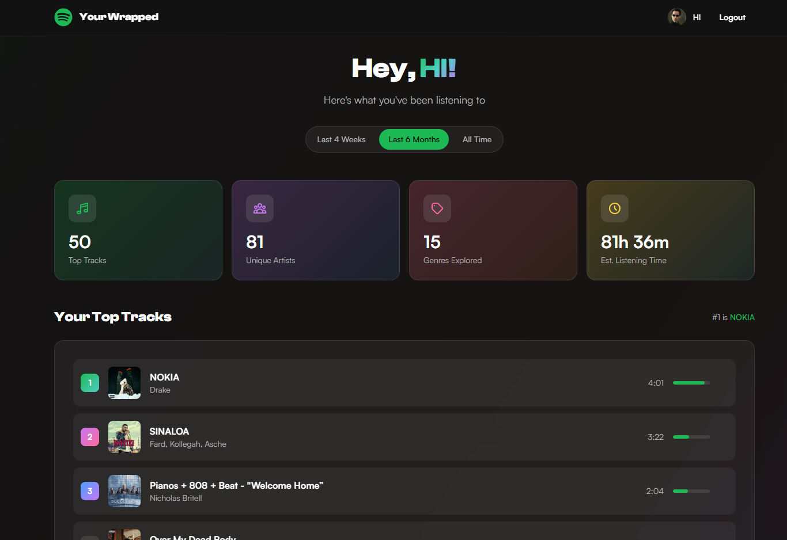

# Spotify Wrapped

Your personal Spotify analytics dashboard - see your top tracks, artists, and genres.



## Quick Start

### 1. Create a Spotify App

Go to [developer.spotify.com/dashboard](https://developer.spotify.com/dashboard) and create a new app.

Set the **Redirect URI** to:
```
http://127.0.0.1:5173/callback
```

### 2. Setup

```bash
git clone git@github.com:sd3v/wrapped.git
cd wrapped
npm install
cp .env.example .env
# Add your VITE_SPOTIFY_CLIENT_ID to .env
npm run dev
```

Open [http://127.0.0.1:5173](http://127.0.0.1:5173) 

## Tech Stack

React • TypeScript • Tailwind CSS • Framer Motion • Recharts
